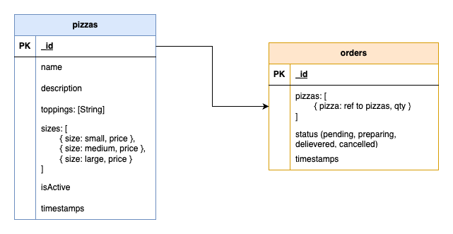

# Local Pizza Ship

## Project Overview
The goal is to create a RESTful
API that allows the shop to manage its pizzas and orders.

---

## System Requirements
Ensure your system meets the following requirements before proceeding:

- **Node.js**: v21.2.0 or higher
- **npm/yarn**: Latest version
- **MongoDB**: v4.0 or higher (for backend database)
- **Browser**: Chrome/Edge/Firefox (latest version)
- **Operating System**: Windows/Linux/MacOS (any with appropriate Node.js support)

---

## Installation Instructions
1. Clone the repository:
   ```bash
   git clone https://github.com/aaqibgouher/cloudgov.git
2. Change directory:
    ```bash
    cd folder
3. Install dependencies:
   ```bash
   npm install
4. Set up environment variables:
    - Copy env.example to .env
    - Update .env with appropriate values for your local setup.
    - Make sure, you add Port & Mongo DB URL
5. Start the backend server:
    ```bash
   npm run dev

## DB Schema


## Postman Collection
I have also added postman collection, please import it while calling API's.

```bash
   ./Cloudgov.postman_collection.json